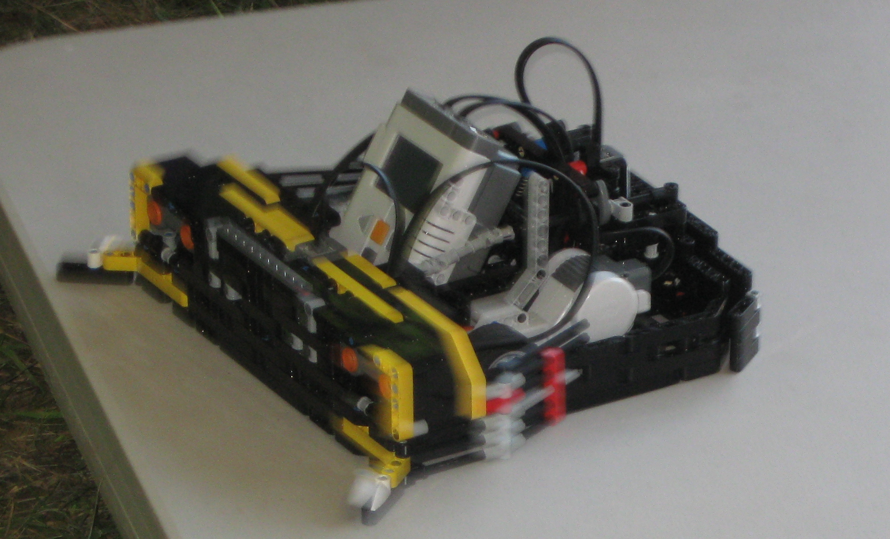

# Battlebots
---

For [Robostorm](robostorm.md), we do a Lego battlebots competition at the 4-H fair every year. The objective is to push the other robot off the field. Although the battlebots are not required to be Lego, they must be under 3 lbs and must fit within the size limit.

## Java

**Autonomous Battlebot**

Although every other battlebot is human operated, I decided to be different and make a battlebot that is completely autonomous. It uses the Lego Mindstorms NXT for the brain, however it was not running the default firmware. I had installed the [Lejos](http://www.lejos.org/) firmware, which allowed me to program it in Java. This was an advantage over the default NXT-G language as it was more flexible and was easier to do more complex programming. The battlebot used two ultrasonic distance sensors on the front, one on each side, to detect the opponent and go towards it. It also had touch sensors on each side on the front to detect the edge of the field in order to avoid it. Furthermore, there was a bumber on the back that would cause it to reverse if it was getting pushed from behind. Surprisingly, it managed to get second place in one of the competitions.
