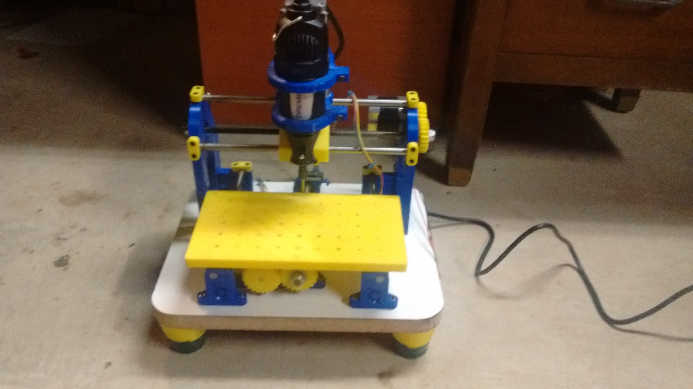
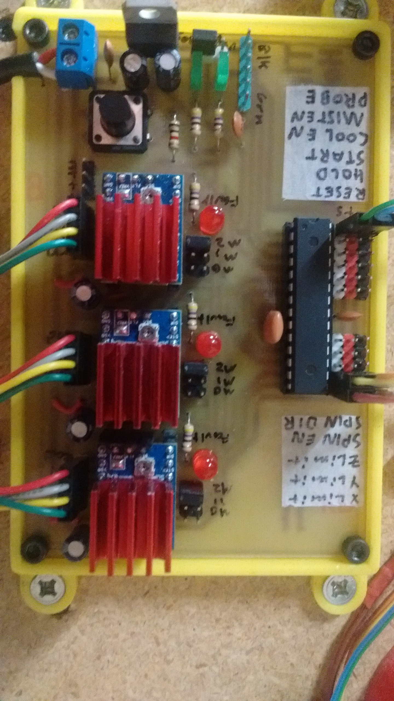
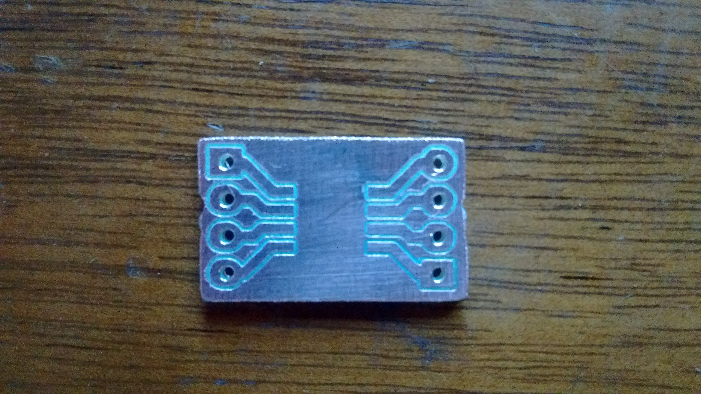
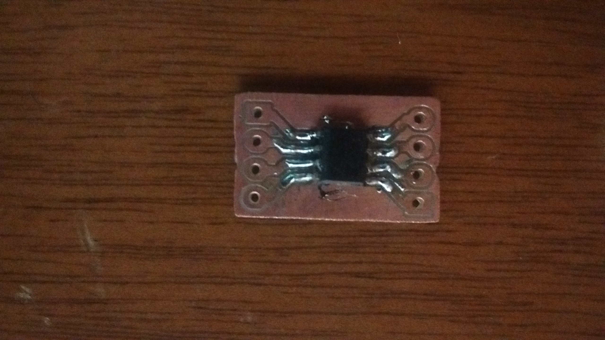
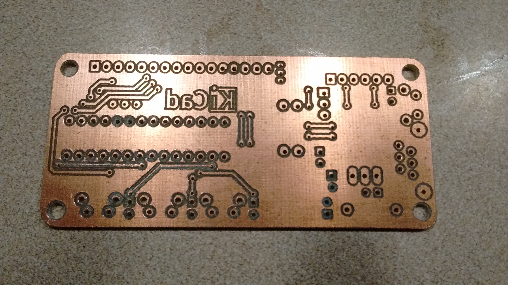
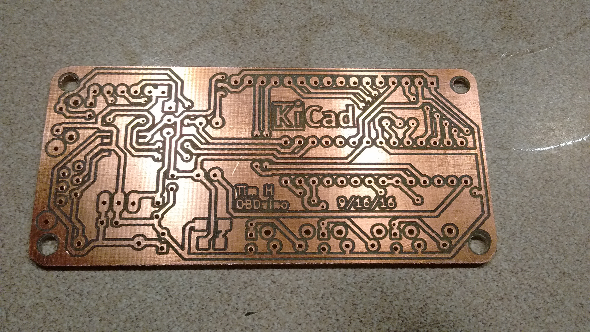

# Cylcone PCB Mill
---

I have been making circuit boards using the toner transfer and etching acid method since I was a kid, and I had always despised it. The process was long, messy, and error prone. Since I had gotten my [3d printer](3dprinter.md), I had always wanted to add a Dremel to mill the copper off a circuit board. I acually tried this, and it seemed to work, but I did not have any real bits to use. After this initial sucess, I decided to build a dedicated machine for pcb milling. I did some searching, and found the [Cyclone PCB Factory](https://github.com/CarlosGS/Cyclone-PCB-Factory) on GitHub. It used a Dremel for the spindle, and most of the frame was 3d printed.

The one thing I did not like about it was that it could only hold one size PCB in the clamps. I fixed this issue in [my fork](https://github.com/chickenchuck040/Cyclone-PCB-Factory) that adds a 3d printed workbed with holes every 20mm. There is an inset for a nut at the bottom of each hole, and I tapped them all to M3. That allows the screwing down of smaller clamps to hold smaller boards, or screwing the boards directly to be bed.

### Building

After coinvincing my dad to order the parts, the assembly went relativly quickly. The only issue I had was getting the frame square, for which I modified some of the parts to have slots for screws to make alignment easier. I also decided to make my own control board to run the opensource CNC firmware [grbl](https://github.com/grbl/grbl). It is made to run on an Arduino UNO, but I did not have any UNOs around. However, I did happen to have some atmega328s around, the microprocessor that the UNO uses. I decided to make my own control PCB using the toner transfer method, integrating the atmega, stepper controllers, and voltage regulator on one board. I first made the circuit on a breadboard, to ensure that everthing would work as it should.

### Making the control board

After some issues with blowing stepper drivers (They don't like to be powered with not stepper attached!), I went ahead and made the control PCB. After etching it, I decided that the mill was working well enough on the breadboard to drill all the holes in the board. Lining up the already etched board with the workbed was a pain, but in the end, it worked. It was the first real milling that it had done, and it worked great. I put all the components in the board, and there were no issues. After mounting it, the next step was to try some acual isolation milling.

### The first PCB

After some initial calibration to figure out the milling depth and width, I was ready to try my first board. It was a breakout for the Raspberry Pi on my 3d printer, to replace a perfboard that I have made earlier. All it had to do was combine power, some GPIOs, USB and audio into a 9 pin serial connector to interface with the printer. My setup before had worked, but it was a bit fluky, and needed to be replaced. The board was good for a test, as it was small, and there was nothing particularly difficult. I used 1mm traces to ensure that even if the Dremel cut too wide, it would still work. it turned out to work just fine, and is now serving its duty on the printer.

### Double sided and sourface mount

As I had just began driving, I wanted to know my gas mileage, so I decided to make an [OBDuino](https://github.com/Magister54/opengauge). The only issue was that in order to talk to the OBD2 port on the car, I would need to use a surface mount chip, the MC33290. Luckily, it was avaible in the SOIC package, the largest of the surface mount varieties.  The pads would need to be only a half milimeter wide, and only a half milimeter apart. As a test, I did a small SOIC breakout board, and soldered on another SOIC chip I had pulled from something.

The other difficulty was that routing all the traces on the board would have required many jumpers. Because I could, I decided to try making a double sided board. That came with two challenges: Aligning the two sides, and connecting the vias. The alignment problem is typically solved by drilling a couple of alignment holes through the PCB and into a scrap piece of wood below it. I did not want to use a scrap piece of wood, as it meant it would need to be replace often. My solution was to drill holes in the board to align with holes in my printed workbed. I used one large PCB the size of the bed, and drilled holes in the corners. This way, it would be a mirror image when I flipped it over. I would need to manually flip and move the Gcode for the bottom of the board in the GUI that I use (BCNC) to match what what was on the top. Luckily, it worked out fine, but ther holes were not quite lined up, but they were good enought to solder.

### Brushless Spindle

 had about the same power as the Dremel, and had about the same max speed. The only challenge was to connect the 5mm screw shaft of the motor to the 8mm collet extention, in such a way that it was balenced at 30,000 RPM. I ended up with a hose pressed over some nuts on the motor shaft, and zip tied over the collet extention. It is not perfectly balenced, but seems to be better than the Dremel.

I also had to design an enclosure for the spindle, ideally the same size of the Dremel to fit into its mounts. I decided to use a CAD program called [Onshape](https://www.onshape.com/), because it would allow working on it from school. Onshape is a full browser CAD that aims to compete with CADs such as Autodesk for modeling. I have found that it works very well, and is easier to use that other CAD softwares. I was able to model the entire spindle, including the motor, collet extention, hose, screws, and nuts that would be used. The model is available for anyone to veiw [on Onshape](https://cad.onshape.com/documents/2160b9641f37717be3bf280d/w/9c6fe6c0d14768184fa9a563/e/5a8781c1465b9b6b1cb1d99e).
