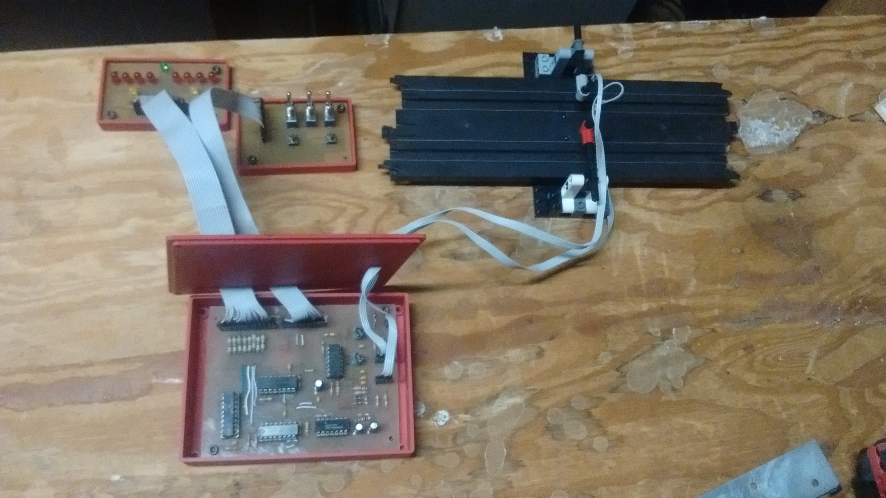
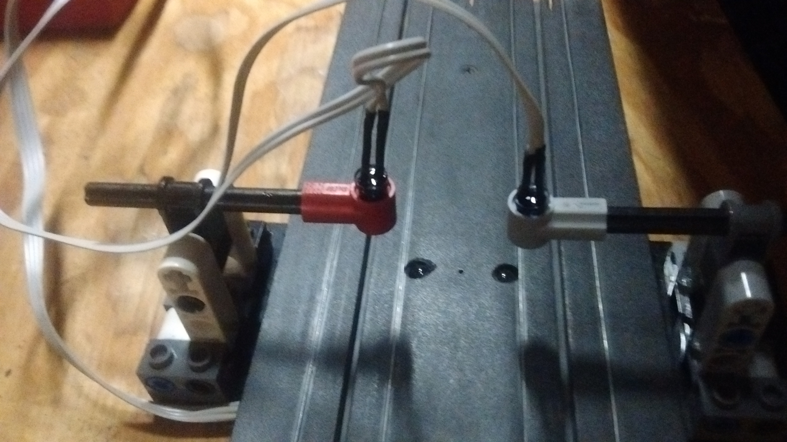

# Slot Car Lap Counter
---

For the longest time, I had a set of old TYCO slot cars. Once I got good at driving them, I had found it difficult to keep track of lap counts and race at the same time. After organising all the assorted ICs that my dad had collected, I found some binary counters along with other ICs So I began developing an automated slot car lap counter.

I began on a breadboard, with only one counter for one of the lanes. I would detect the slot car with an IR beam break setup, with the emitters above the track and the detectors in the track. That would then feed into the input of the counter, which in turn would feed to a buffer to drive the LEDs. Once the basic circuit was setup on a breadboard, there was a problem. Everything would work fine when the beam wss manually broken, but would fail when a slot car was run through it. The LEDs wpuld flicker as if it were being counted too many times very fast. I hooked it up to my dad's old ocsliscope, and found that slot cars happen to create lots of electrical noise, which was causing the counter to trigger too fast. My first course of action was to add a buffer to the input in the form of inverters with schmitt triggers. Unfortunatly, they did not help much. Next, I tried every way of noise prevention I could think of, including shielded wire to the detectors and enclosing everything in a metal box. None of it worked.After thinking a while, I devised a simple circuit consisting of a capacitor, two resistors, and a diode. The idea was that the capacitor would charge up very quickly through a small resistor, then discharge through the large resisor and dipde much slower, in order to cancel out any spikes from noise. Thos was then fed into a comparator to detect when the capacitor was above a certain voltage, and then trigger the counter. After first testing the circuit in a simulator and getting aproxamate capacitor and resistor values, I built ot on a breadboard. Surprisingly, it worked! With the ocsiliscope, I was able to see the imediate buldup in the capacior, then the slow discharge through the large resistor. Hooking this up to a comparator was relativly simple, and was then hooked to the rest of the circuit. I had put a potentiometer on the comparatornas well, to adjust the sensitivity of the input circuit.Once thw breadboard wad made, a schmatic was drawn up, and a circuit board was etched, containing two counter circuits, one for each lane. It was then put in a 3d printed box and connected to the rest of the slot car track.

