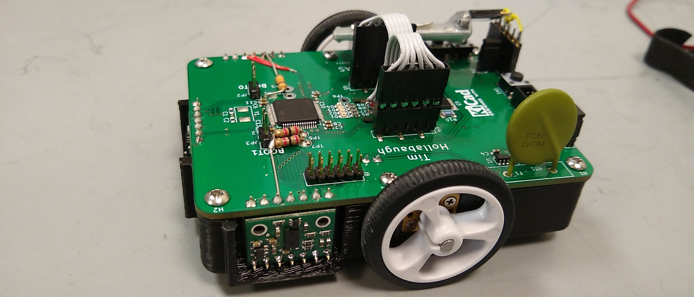
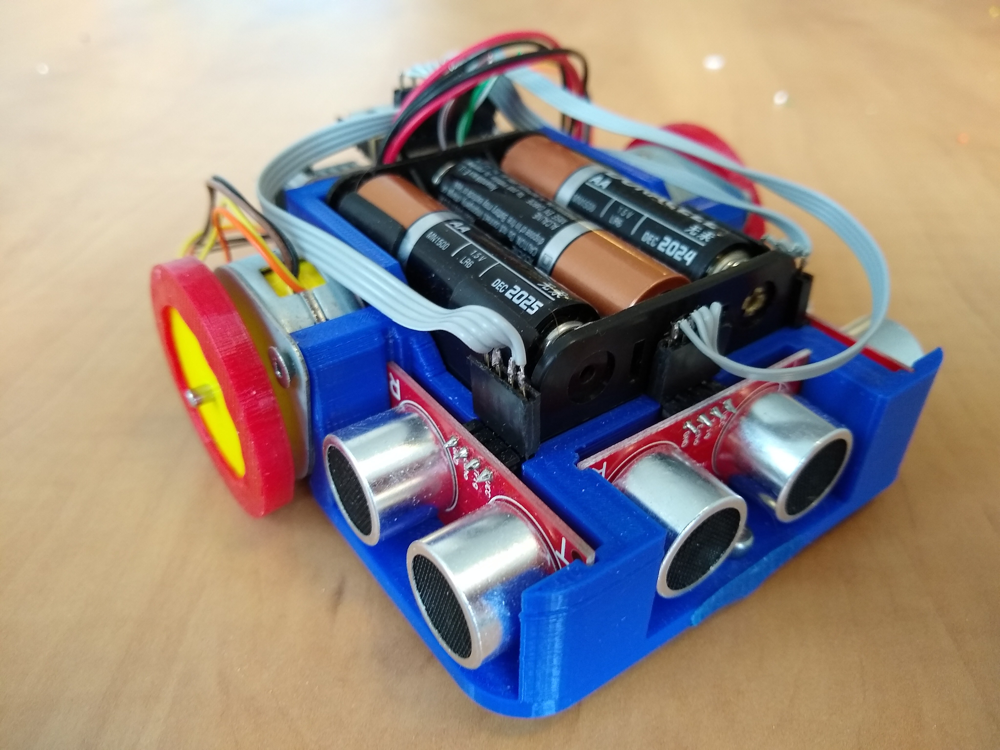

# Micromouse
---

Every year, IEEE runs a micromouse competition at the Student Activities Conference (SAC) in each region. Small robots, called 'mice', must navigate to the center of maze. The maze is layed out on a 16x16 grid, with walls between some of the grid verticies, and the mouse with the shortest time to the center wins.

## Micromouse v2 (Spring 2019)

After micromouse v1 failed, I decided to redo everything and carefully choose every part to do exactly what was needed. In talking with people who had competed in micromouse in previous years, I learned that it was pretty good if you could move around reliably. As such, the goal for this SAC was to be able to move around quickly and accurately, and maybe make it to the center. This would provide a solid base to build upon for future competitions.

This mouse was built as a part of the Robotics and Automation Society (RAS) at Rowan. I did all the electrical work and most of the software, while other team members worked on the 3d printed frame, a test maze, and the maze solving algorithm.

### Hardware

Movement was accomplished by two geared dc motors and two magnetic encoders. This would provide plenty of speed and torque, with the encoders providing accurate measurements. The motors were driven with a DRV8848 dual H bridge.

To sense the walls and center in the maze, three [VL6180X Pololu breakout boards](https://www.pololu.com/product/2489) were used. They are time-of-flight sensors, so they will send out a laser and measure how long it takes to come back. This give about 1mm resolution, which works great to both sense walls and center within the walls. They talk over I2C, but the only was to change the address is over I2C. To make this work, three seperate I2C busses were used.

Because the motors can now run on a lower voltage, a 2s lithium battery was used for power. This is a lot lighter and smaller, allowing faster movement.

To control everything, an stm32f405rg was chosen. The killer feature was the encoder mode on the timers. In this mode, the timers will count the encoder pulses, counting up or down appropriatly. This meant that we did not need an interrupt to fire on every encoder count, reducing code complexity and computational power. The stm32f405rg also has three I2C busses for all the sensors, as well as plenty of ram and cpu speed. All of this was thrown onto a custom board to keep everythin in one peice. The board also included a few buttons, LEDs, voltage regulator, and a polyfuse. The polyfuse ensured that if there was something wrong with the board, like a short accross the battery, there would not be too much current drawn from the battery and a possible fire would be avoided. There is also a UART header exposed to allow for easy debugging. This allowed us to use a bluetooth-serial module for wireless debugging, making life tremendously easier.

This hardware worked pretty well, but there were a few issues after the board was made. The motor driver will go into parallel mode, driving both motors off the same input, unless a signal is applied to the second control pins at startup. This happened before the stm32f405rg even got a chance to do anything, so a set of pull down resistors had to be added. Also, I found that the BOOT0 pin had to be pulled high, not low, to enter serial bootloader mode. A resistor was added for this, but it ended up being so slow that we didn't use it. Finally, the SDA and SCL lines were switched for one of the distance sensors. Oops!

### Software

The software was all written in [Rust](https://www.rust-lang.org/), a relatively new systems-level language. Rust provides all the low-level hardware access that C does, but with a lot of higher level features. One of the biggest selling points, however, is complete memory safety. The Rust compiler will ensure that all memory is cleaned up and there are no funny data races going on without a garbage collector. The Rust compiler supports Cortex M4 processors, and we used the [stm32f4](https://github.com/stm32-rs/stm32-rs) crate to provide register definitions, along with [embedded-hal](https://github.com/rust-embedded/embedded-hal) and  [stm32f4xx-hal](https://github.com/stm32-rs/stm32f4xx-hal) for higher level access to things like I2C.

Motion control was one of the biggest things we were concerned with for the software. In order to provide snappy and accurate moves, a few different layers of control were used. At the lowest level is the direct PWM motor control and encoder readings as provided by the `Motor` and `Encoder` traits. This level will attempt at nothing more than setting the PWM duty cycle and reading direct encoder values, abstracting hardware details from the higher levels.

Next up is the `Bot` struct, which controls two motors with encoders and the distance sensors. This provides a differential drive interface. It contains two PID loops, which control the speed of each motor. This helps account for any slight variations in the motors and any load they are under. Instead of dealing with a unitless, squishy PWM value, we are now dealing with a velocity defined in encoder ticks / ms that will be kept as close as possible. The `Bot` struct also handles converting the linear and spin velocities into left and right motor speeds, and vice versa. This makes math at higher levels a lot easier.

The next level is the `Control` struct. This will control the entire bot, taking in commands like 'go straight for 1000 ticks' or 'turn right 500 ticks' There are separate sub-controllers for linear and spin movement, since they are handled differently.

The spin controller contains a single PID loop that controls the spin position. This works pretty well. The linear controller, on the other hand, is a bit more involved. Not only is there a PID controller for linear distance, but there is also one for direction and a P controller for centering.

The linear distance controller works off the linear encoder distance most of the time, but switches to the front distance sensor when a wall is within range. When in front-distance-sensor mode, the target for the linear PID gets switched to a constant value from the wall. This is based on the assumption that the bot will always be stopping in the center of a grid square, which is a known distance from the wall in front of it. The direction PID controler works off the spin position to help ensure that the bot drives straight. The centering P controller then controls the spin position to ensure that the bot is in the center of the grid squares. It works in one of three modes: centering between two walls, keeping a fixed distance from one wall, or relying on the encoders to go straight. If there are two walls detected, and the sum of the distance to the walls is less than the grid square width, centering mode will be applied. This tries to keep the difference between the left and right distances at zero, so the bot is in the center between them. If the sum of the distances is larger than the grid square width, or if only one wall is detected, the mouse will attempt to keep a constant distance from the nearest wall. Finally, if neither of the walls are detected, the mouse will rely entirely on the encoders to go straight. Since centering based on the walls only really works while the mouse is moving, the centering P controller will stop when the linear PID gets close to it's endpoint.

The linear, direction, and spin PID controllers all have an acceptable error bound and settle time; the controller will stop once the error is within the range for the entire settle time. This gives a reasonably accurate complete condition that still allows for some noise in the sensor readings.

Above the `Control` struct is the `Plan` struct. This deals with moves such as 'move one square forward' or 'turn left'. It converts these high-level commands into linear ticks or spin ticks, and executes the appropriate move on the `Control` struct. The `Plan` struct buffers these moves , allowing multiple moves to be queued and executed without any delay. It also keeps track of which grid square the mouse is within the maze and its heading based on the moves that have been executed.

Finally, the last layer is the `Navigate` trait. A struct that implements this trait defines the actual maze solving algorithm. The trait requres a single function to be implemented; this function takes the position, heading, and possible directions it could move in. It then does whatever calculation it needs to do and returns a set of moves to execute. Because the navigation is a trait, multiple navigation algorithms can be implemented, and one of them chosen at compile time. Perhaps more importantly, this lets us write a micromouse simulator that uses the same `Navigate` trait as the bot. The same code can run on a desktop with a GUI as on the mouse, which makes writing and debugging althorithms a lot easier. Unfortunatly, we did not have time to complete the simulator with a GUI.

There are a lot of configuration values at each layer in the stack, from P, I, and D constants to information about the maze itself. All of this resides in the `BotConfig` struct, which allows everything to be grouped in one place and easily changeable. Furthermore, there is a nice command line interface over UART that allows each parameter to be changed at runtime. This make tuning a lot easier. Also included in this is the ability to test out any of the functions of the different layers. For example, moves can be added to the planner buffer and wheels can be spun at different speed directly. Because of the serial-bluetooth adapter, all of this is usable without ever touching the mouse or tethering it.

Overall, the entire stack works nicely. We were able to implement a basic maze algorithm at the competition, but it was not ready in time for our run. This shows how easy it is to define new algorithms and change them out. We switched between the new algorithm and the random one a few times during the competition as we went between testing and official runs with absolutely no issues. All of this is due to Rust's borrow checker, high level language features, and low level control. Writing a five layer stackup with well defined interfaces and portability in C would have taken significantly longer and have had a lot more bugs. Furthermore, we were able to use ready-made hal libraries, PID implementations, fixed-size buffers, and random number generators due to the wide variety of Rust crates available for embedded targets and the ease of integration.

This provides a nice base up which to build further work. Now, complex maze solving algorithms can be implemented with little effort, the motion can be made faster and smoother, and the hardware more compact. All of this can even happen in parallel, by different teams, because of the defined interfaces and portibility of the code.

But how well did we do at the competition? We got first place, of course. We got two 10 minute runs to let the mouse loose in the maze. The first run got very unlucky: the random decisions got us nowhere near the center, and it even went back to the start a few times. However, we changed the seed for the random number generator for the second run, which made it to the center in only 3 minutes and 21 seconds. Furthermore, both runs were done entirely without touching any walls or loosing position. Only one other mouse made it to the center, but it moved very slowly. Everyone else had a lot of issues with moving around consistantly, and coudl onyl make it a few squares without hitting a wall and getting completely lost.

## Micromouse v1 (Fall 2019)

In order to compete in the competition in April, I decided to start early in September to give plenty of time. Since this was my first micromouse, I tried to keep the components simple and what we had in stock.

Stepper motors were used for motion, since they do not require encoders and can be controlled precisely. They were driven with DRV8825 stepper drivers the same as my 3d printer. The stepper motors worked enough to move, but they had some problems. To start, the drivers required at least 8.2v to operate. This meant a relativly large battery. But a bigger issue was that the stepper motors were pretty slow and skipped steps often if driven quickly or there was anny resistance to movement. This made moving quickly quite difficult. It probably would help to implement acceleration to get to a higher speed.

For sensing the walls, I used ultrasonic sensors, mainly because I had some available. There were 3 of them, one on the front, left, and right of the mouse. This would allow the mouse the sense the wall around it and center itself between the walls. The ultrasonic sensors used two pins to operate: one to trigger a pulse, and one that goes high for a time proportional to the distance. Unfortunatly, the interrupt pins on the atmega328 I was using were limited, so I ended up using a 4:1 mux to be able to switch between the three sensors. This worked pretty well, and ensured that no two sensors were pulsing at the same time to reduce interference. However, it turns out that the range and accuracy of ultasonic sensors is pretty limited. Since the walls on the maze are only about 18cm apart, there was only a few centimeters of room to each side of the mouse. The ultrasonic sensors were able to sense if there was a wall there, but were not good enough to tell how far away it was reliably.

The micromouse was powered from a 6 pack of AA batteries to ensure that there would be no lipo fires, and because they were available. 6 AA batteries provided about 9 volts, above the minimum voltage of 8.2 volts on the stepper drivers. This worked as long as the batteries were fully charged, but it did not take long for the voltage to drop below 8.2 voltages and cause a lot of missed steps. The batteries were also large and heavy, which didn't help moving quickly.

The control was provided by the an atmega328pu on a custom milled board, again, because I had them available. This board includes the atmega, the stepper drivers, a voltage regulator, the ultrasonic sensor mux, some buttons, and some leds. Not everything would fit onto one board, so they were split into two boards and stacked. This worked pretty well. The only issue was that the atmega328 was not really powerfull enough to deal with the sensors, motors, and do maze solving. All three timers were used for the motors and ultrasonic sensors, and there was bearly enough ram to hold an entire maze.

Overall, I was able to get this mouse to move around, sense walls, and have a nice command line interface over UART. This was enough to make me change my mind about using only parts that we had, so I decided to redo it in the spring semester.

