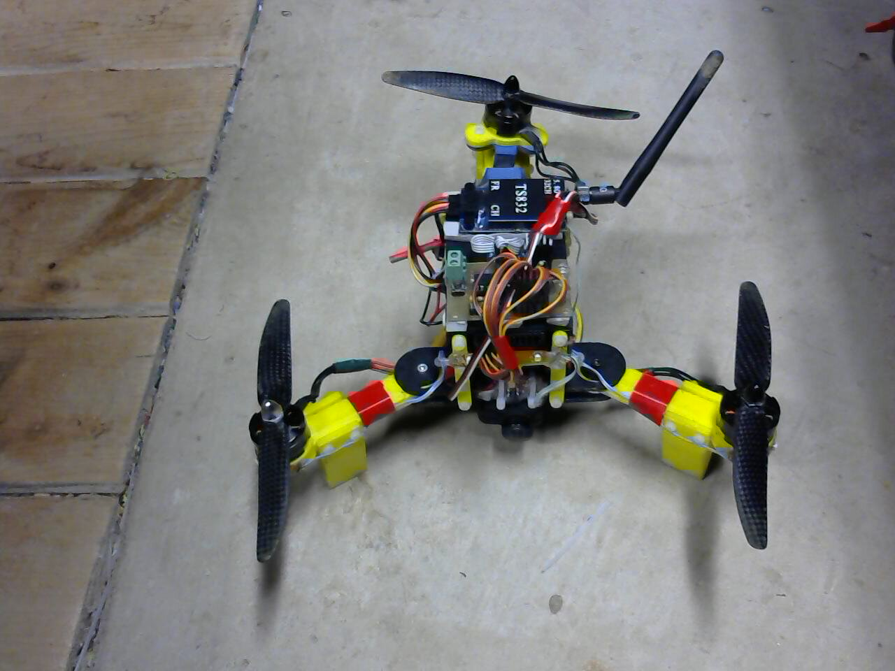

# Mini Tricopter
---

Ever since I have seen my friend's commercial multirotor, I have wanted to build my own. I decided early on that it would be a tricopter, due to its unique flight style and slightly lower expense (3 motors, speed controllers, and propellers instead of four). Tricopters have the unique feature of having a servo on the rear motor to turn, rather than changing the speeds of the motors to turn from the counter rotational force.

After getting tired of trying to maneuver the beast of the [large tricopter](largetricopter.md) that I had, I decided that it was time for a redesign. This time, I aimed to fit it within the 250 class for racing multirotors, meaning about 250 millimeters between opposite propellers. I designed a new from to be 3d printed, based off the frame from my larger tricopter. I made a custom control board to try to make it as small as possible, as well as being cheaper. It uses 5 inch propellers, as opposed to the 8 inch propellers that the larger one used, making way smaller. It is very maneuverable, and rather speedy. Unfortunately, the processor on the control board does not appear to be able to handle rapid accelerations, causing it to flip and crash it I move it too fast. The easiest solution to this is to buy a board with a faster processor, but I have not gotten around to that. I have also added lights to it to allow for night flying, which is definitely the best time to fly.

## FPV

After some time off flying be sight, I wanted to go FPV. FPV is when there is a camera on the copter that streams a live stream down to a monitor on the ground. This monitor is then solely used to fly the copter. I got a [Mobius](http://mobius-actioncam.com/) and a FPV transmitter and receiver for my tricopter, and I use an old TV as a monitor.
