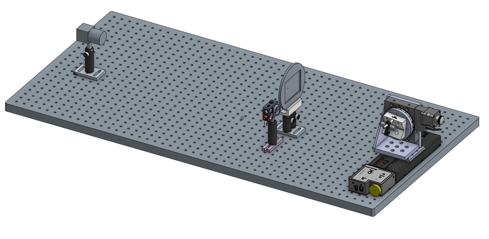

# Princeton Plasma Physics Lab Internship
---

After my senior year of highschool, I managed to get an internship at the Princeton Plasma Physics Lab (PPPL) over the summer. PPPL is a government departement of energy lab that is run through Princeton University. Their main purpose is to run test nuclear fusion reactors.

There, I wrote some python code to automate the calibration of infrared Video Imaging Bolometer (IRVB) setups. Bolometers are devices used to measure radiation. PPPL uses these devices to measure the radiation from the plasma inside their test fusion reactors. Most bolometers can only measure the radiation at a single point. Some can be placed in a grid to gather course two dimensional data. IRVB uses an infrared camera to get a high resolution image of the radiation.

IRVB works by shining the radiation through a pinhole aperture, and onto a metal film. The metal film we used was a 2.5 micron film of platinum coated with graphite to make it darker. This film gets heated up by the radiation from the plasma through the pinhole, and thus begins to emit infrared light. This infrared light can then be picked up by an infrared camera.

Because of irregularities in the metal foil and infrared camera, the system must be calibrated for every point on the foil. This is usually done by shining a laser at the foil to emulate the plasma, then move the laser to points on a grid and at various powers and frequencies. Unfortunatly, this method is very time consuming to perform by hand.My task was to write some Python code to move around the laser and adjust the power and frequency, as well as capture frames from the camera and match them up with each laser point. The code has a graphical interface to allow editing the configuration, and can import a list of points from a csv file, and exports data to csv files.

